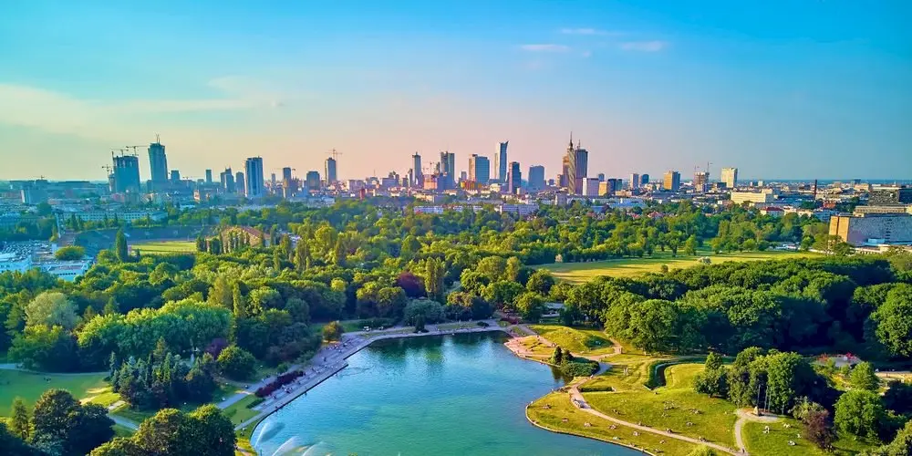
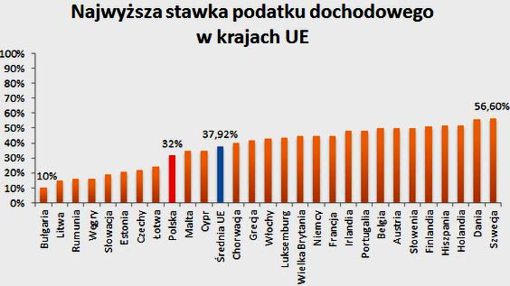
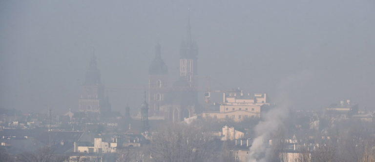

# habr-article

## Польша: перекат для чайников.

Здравствуйте, дорогие хабровчане! Недавно я прочитал исчерпывающий [гайд по Германии](https://habr.com/ru/post/581512/), и захотел написать что-то подобное для Польши. В статье я постараюсь описать плюсы и минусы переезда (по крайней мере для айтишника), примерную стоимость жизнь и что стоит сделать в первую очередь после переезда. Конечно подобных статей уже написано немало, но большинство либо написаны агенствами по эмиграции и не отличаются объективностью, либо просто описывают историю успешного успеха и им не хватает цифр. Разумеется, и эта статья тоже не может быть максимально объективной, но я все же попробую.

## Почему Польша?

Давайте разберемся, почему все же Польша, а не более популярные страны западной Европы? Когда происходил выбор страны для эмиграции я просто составил себе таблицу с рядом критериев, вроде стоимости жизни, климата, условий получения ВНЖ и т.д.
Польша победила в сравнении, имея следующие преимущества:

- **Стоимость жизни**

Стоимость аренды жилья в крупных городах примерно на уровне Санкт-Петербурга, в некрупных ниже в полтора-два раза. Продукты одни из самых дешевых в Европе. Налоги также ниже среднего по ЕС, на уровне 32 %. Более подробно по ценам будет расписано ниже.

- **Язык**

Из всех стран ЕС только в Ирландии государственным языком является английский, и учить местный язык и сдавать экзамен на резидентство/гражданство все равно придется. Да, в большинстве стран, особенно в крупных городах, многие жители на каком-то уровне [знают английский](https://ru.wikipedia.org/wiki/%D0%90%D0%BD%D0%B3%D0%BB%D0%B8%D0%B9%D1%81%D0%BA%D0%B8%D0%B9_%D1%8F%D0%B7%D1%8B%D0%BA#/media/%D0%A4%D0%B0%D0%B9%D0%BB:Knowledge_of_English_EU_map.svg), и в IT особенно можно обходиться только им, но всегда есть вероятность столкнуться с непонимающим тебя собеседником. Языки романской/германской групп меня не привлекали, финно-угорские тем более, венгерский - нет, спасибо. Языки славянской группы сложны в изучении, но выходцы из России/Украины/Беларуси имеют явное преимущество, так как базовая лексика и основы грамматики очень похожи во всех славянских языках. И если на слух поначалу придется привыкать к местной фонетике, то читать и понимать большинство надписей получится сразу. Кстати, из-за миграции людей преимущественно из русскоязычных стран - все важные анкеты и многие статьи на правительственных сайтах продублированы на русском языке.

- **Легкие условия эмиграции**

Насколько я понял во многих странах ЕС члены семьи работающего эмигранта не могут приехать с ним сразу, и работник должен подавать на воссоединение семьи, отработав определенный срок. Обычно через полгода-год. В Польше члены семьи мигранта могут сразу подавать вместе с ним на ВНЖ, указав "другие обстоятельства", единственное условие - он [должен иметь доход](https://cudzoziemiec.bydgoszcz.pl/ru/ostatsya-v-polshe/vremennoe-prebyvanie/drugie-obstoyatelstva/) 701 zł на себя и 528 на содержание каждого члена семьи. Но с МРОТ 2800 zł это несложная задача. В 2022 минимальная зарплата будет составлять уже [3010 zł](https://www.bankier.pl/wiadomosc/Placa-minimalna-w-gore-do-3010-zl-w-2022-roku-8187440.html). Для получения долгосрочной визы кроме традиционных путей через приглашение на работу и учебу доступны 2 легких варианта: через [языковые курсы](https://together-school.pl/head/viza) и программу [Poland Business Harbour](https://www.gov.pl/web/poland-businessharbour-ru/itspecialist).

- **Близкий менталитет**

Судя по статьям людей, переехавших в например Германию или скандинавские страны, менталитет жителей может сильно отличаться от привычного, и поначалу это может вызывать дискомфорт. В Польше менталитет очень близок к другим славянским странам, разве что люди мне показались немного более открытыми, но это уже субъективно.

- **Безопасность**

Польша имеет один из самых низких [показателей преступности, насилия и вандализма](https://ec.europa.eu/eurostat/web/products-eurostat-news/-/ddn-20210310-1?redirect=%2Feurostat%2F) среди стран ЕС.

- **Кухня**

Нередко можно встретить жалобы мигрантов на отсутствие в магазинах привычных продуктов, вроде квашеной капусты или кефира. И впрямь, большинство из нас имеет устоявшиеся вкусы и не готово сильно рацион. Если Вы любите кисель, гречку и творог и не готовы от них отказываться или переплачивать в локальных русских магазинах - Польша Вам подойдет.

## Почему не Польша?

Упомянув о плюсах - невозможно пройти и мимо минусов.

- **Смог**

О нем уже много написано в интернете, и данная проблема имеет место быть. С середины осени запах гари нарастает, и порой кажется что ты живешь около локомотивного депо. Все дело в старых печах, которые бедняки топят всяким мусором. Правительство [субсидирует](https://czystepowietrze.gov.pl/stop-smog/) замену печей на современные, но далеко не все спешат перейти на газ по экономическим причинам. С другой стороны в последние годы ситуация улучшается, в основном благодаря большим штрафам за сжигание мусора.

- **Консервативное правительство**

В данный момент бал правит "Право и Справедливость". Партия придерживается национал-консервативной идеологической ориентации с элементами клерикализма, поддерживает тесные связи с католической церковью и близкими ей организациями. Многие ее осуждают за популистские решения, закручивание гаек по религиозным причинам (запрет абортов, нерабочие воскресенья), ультраконсервативную политику и нападки на ЛГБТ.

- **Близкий менталитет**

Я не исключаю, что некоторые люди эмигрируют с надеждой кардинально изменить свою жизнь, чтобы все было новое - новые люди, новые порядки и привычки в обществе, и Польша будет слишком напоминать, например, Россию.

- **Зарплаты**

На данный момент зарплаты айтишников, в среднем по Европе, не сильно отличаются. В то же время зарплаты рядовых технических специалистов не так велики, и средние зарплаты после налогов в разных регионах [составляют 3900-5300 zł](https://businessinsider.com.pl/twoje-pieniadze/praca/mapa-zarobkow-polskich-ostatni-rok-przyniosl-podwyzki/kehx0v0).

- **Бюрократия**

Если Вы были избалованы госуслугами - забудьте, ибо ждут Вас в основном анкеты, телефонные звонки и по-разному выстроенные процессы одного и того же заведения в разных городах. Многие анкеты можно подавать онлайн, но единого портала нет. В одном городе городское управление может иметь подачу анкет онлайн, в другом может не иметь, ответы могут присылать заказными письмами через неделю-две вместо ответа на портале. Чтобы записаться в одно отделение больницы - Вам потребуется прислать скан анкеты на почту, во второе отделение нужно записываться в общей регистратуре, а в третье посетить регистратуру этого отделения. Здорово? Не очень, но ничего не поделаешь...

## Как попасть в Польшу.

Для начала необходимо получить визу. В связи с коронавирусной ситуацией шенгенские визы C сейчас не выдаются, и въехать из-за пределов ЕС наиболее реально только с долгосрочной визой D по причине [работы, учебы или программы Poland Business Harbour](https://strazgraniczna-pl.translate.goog/pl/cudzoziemcy/covid-epidemia-koronawi/8587,file.html?_x_tr_sl=uk&_x_tr_tl=ru&_x_tr_hl=en&_x_tr_pto=nui). На визе по работе останавливаться не буду, здесь процесс и пакет документов достаточно стандартный.

Для получения визы по языковым курсам вполне подойдет годовой курс с занятиями несколько раз в неделю - так наберется необходимое количество учебных часов и основание находиться на территории Польше в течение года. С получением визы проблем обычно не возникает, но могут возникнуть вопросы у пограничников. Специально для таких случаев языковые школы записывают своего учебника заодно в полицеальную школу и подгадывают начало своих учебных занятий под весеннее-осеннее начало занятий в полицеалках. **Это важно:** получить визу надо именно по языковой школе, потом попасть на территорию страны и написать письмо с просьбой отчислить Вас из полицеальной школы.

В случае с визой по Poland Business Harbour список необходимых документов указан на [сайте программы](https://www.gov.pl/web/poland-businessharbour-ru/itspecialist), главное суметь подтвердить свой рабочий опыт в течение минимум года (перевод трудового контракта на польский) и получить пруфы заинтересованности польской it-компании в Вас (рекомендательное письмо, оффер). Попав на территорию необязательно устраиваться к тем, с кем собеседовался, можно потратить немного времени и повыбирать получше, либо же спокойно пожить, осмотреться и решить хочется ли вообще здесь оставаться.

На подачу визы записываться на [vfsglobal.com](https://www.vfsglobal.com/Poland/Russia/Moscow/index.html) и следовать инструкциям на сайте. Для подтверждения аренды жилья вполне подходит распечатка бронирования из airbnb. Отель для Ваших целей не подходит, позже объясню почему.

## Окей, я прилетел, что дальше?

Вы в аэропорту, и самое необходимое на данный момент - это связь. Pre-paid сим-карты можно купить в местных салонах сотовой связи, магазине сети żabka и во многих ларьках. Существует несколько вариантов:
- Сим-карта не требует подписания договора, стоимость цикличного пакета будет списываться раз в месяц.
- Сим-карта требует подписания договора, обычно на год-два, и за счет этого вы получаете (или не получаете, или получаете, но не сразу) более выгодные условия.

Поначалу рекомендую выбирать сим-карту без договора. Потом, когда разберетесь в условиях разных операторов и поймете свои потребности - можно заключать договор, а старую карту выбросить в мусор без всяких обязательств. Звонки и смс по Польше обычно безлимитные + бонусом несколько часов разговора по ЕС. Разница только в доступном траффике и дополнительных услугах. Примерное сравнение условий на pre-paid сим-картах можно посмотреть [здесь](https://www.traveltomtom.net/destinations/europe/poland/best-prepaid-sim-card-poland). **Это важно:** обязательно попросите продавца зарегистрировать карту, для этого понадобится предоставить загран-паспорт.

Теперь можно вызвать такси и поехать заселяться. На получение визы Вам потребовалось предоставить подтверждение бронирования жилья, и не так много вариантов это было сделать:
- Подписанный договор аренды жилья - способ практически невероятный, если Вам никто не помогает на территории Польши. Я не могу придумать ни одну причину, которая заставит польского арендодателя начать обмениваться документами с гостем из далекой страны, чтобы подписать 2 экземпляра договора и сдать ему квартиру.
- Регистрация в отеле - плохой вариант, так как не позволит вам зарегистрировать свое проживание в местном городском управлении (urząd miasta - ужонд мяста), а без этого Вам не получить PESEL.
- Airbnb/Booking.com - бронирование жилья дольше чем на 30 дней позволяет вам заключить договор найма с арендодателем (umowa najmu - умова найму) и получить заветную регистрацию по месту жительства (zameldowanie - замэльдование).

Самое важное теперь - взять договор аренды с ксерокопией и поскорее сходить в городское управление. По закону регистрация для иностранцев необязательна, но это самым легкий способ получить налоговый номер PESEL. Этот номер Вы скорее всего выучите наизусть уже через месяц, так как он потребуется везде - каждая анкета, регистратура в больнице, сотрудник банка и Ваш работодатель будут спрашивать его. Наверное, скоро по нему даже бензин и кока-колу будут продавать. Ищем в гугле Urząd Miasta Городнэйм, смотрим рабочие часы, адрес и едем туда. Без предварительной регистрации, вы же иностранец и можете не разбираться в нюансах местной бюрократии. Рекомендую заранее составить и перевести текст для охранника на входе, объясняющий кто Вы, зачем приехали и какие документы хотите получить. Скорее всего он Вас пустит и поможет взять номерок. Служащие ужондов обычно неплохо говорят по-английски, и весь процесс получения мэльдунека и пэсэля займет минут 15.

Получив PESEL советую не затягивать и открыть счет в местном банке, так вы получите возможность делать денежные переводы/получать зарплату. И самое главное - вы сможете сделать себе подтвержденный сетевой профиль (profil zaufany - профиль зауфаны) для подачи разных анкет/обращений на разных местных аналогах госуслуг, например [тут](https://wnioski.mpips.gov.pl/ewnioski/index.eup#page=WWY).
На этом обязательные процедуры закончены, можно вздохнуть с облегчением и начинать жить.
